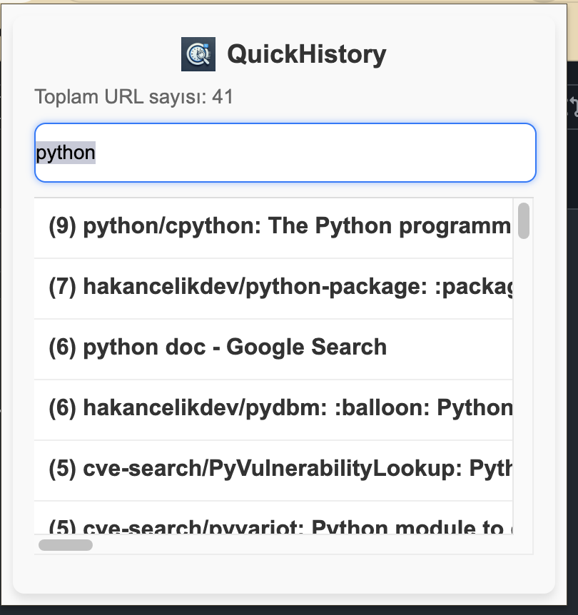

# Quick History



Quick History, Chrome tarayıcınızın geçmiş kayıtlarını etkili bir şekilde yönetmenizi ve aramanızı sağlayan kullanıcı dostu bir Chrome uzantısıdır.

## Özellikler

- 🔍 Tarayıcı geçmişinde hızlı arama yapma
- 📱 Kullanıcı dostu arayüz
- ⚡ Hızlı ve verimli çalışma
- 🔒 Güvenli ve özel veri yönetimi

## Kurulum

### Chrome Uzantısını Yükleme

1. Bu projeyi bilgisayarınıza indirin veya klonlayın
   ```bash
   git clone https://github.com/hakancelikdev/QuickHistory.git
   ```

2. Google Chrome'u açın ve `chrome://extensions/` adresine gidin

3. Sağ üst köşedeki "Geliştirici modu" düğmesini etkinleştirin

4. Sol üst köşedeki "Paketlenmemiş öğe yükle" düğmesine tıklayın

5. 1. adımda indirdiğiniz/klonladığınız klasörü seçin

6. Uzantı artık Chrome araç çubuğunuzda görünecektir

## Kullanım

1. Chrome araç çubuğundaki Quick History simgesine tıklayın
2. Arama kutusuna aramak istediğiniz kelimeyi yazın
3. Sonuçlar anında görüntülenecektir
4. İstediğiniz sonuca tıklayarak ilgili sayfaya hızlıca gidebilirsiniz

## Geliştirme

Projeyi geliştirmek isterseniz:

1. Projeyi fork edin
2. Yeni bir branch oluşturun (`git checkout -b feature/amazing-feature`)
3. Değişikliklerinizi commit edin (`git commit -m 'feat: Add some amazing feature'`)
4. Branch'inizi push edin (`git push origin feature/amazing-feature`)
5. Bir Pull Request oluşturun

## Lisans

Bu proje GNU General Public License v3.0 (GPL-3.0) altında lisanslanmıştır. Detaylar için [LICENSE](LICENSE) dosyasına bakın.

## İletişim

Proje Sahibi - [@hakancelikdev](https://github.com/hakancelikdev)

Proje Linki: [https://github.com/hakancelikdev/QuickHistory](https://github.com/hakancelikdev/QuickHistory)
